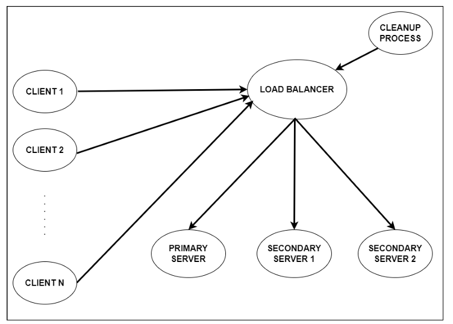

# Distributed-Graph-Manager

## Contributors
| Name |
| :-------- |
| `Pratik Patil` |
| `Himanshu Patil` |
| `Suyash Patil` |
| `Nishit Poddar` |
| `Chinni Vamshi Krushna` |
| `Sarvesh Borole` |
| `Atharva Chikhale` |

## Overview
This project simulates a distributed graph database system involving a load balancer process, a primary server process, two secondary server processes, a cleanup process, and several clients. The system is designed to handle read and write operations on graph databases efficiently using multithreading and load balancing techniques.

## Features
- *Load Balancer*: Distributes client requests to appropriate servers.
- *Primary Server*: Handles write operations.
- *Secondary Servers*: Handle read operations.
- *Clients*: Send read/write requests to the load balancer.
- *Cleanup Process*: Ensures graceful termination of the system.
- *Graph Operations*: Supports adding, modifying, DFS, and BFS on graphs.
- *Threading*: Utilizes multithreading for concurrent processing.
- *Synchronization*: Ensures safe concurrent access to graph files.

## System Architecture

## Components
### Graph Database
- Supports both cyclic and acyclic, undirected, unweighted graphs with self-loops.
- Graphs are represented as text (ASCII) files named Gx.txt where x is a number.
- Each graph file contains:
  - An integer n denoting the number of nodes.
  - An n x n adjacency matrix.

### Client Process
- Sends requests to the load balancer.
- Menu options:
  1. Add a new graph
  2. Modify an existing graph
  3. Perform DFS
  4. Perform BFS

### Load Balancer
- Receives client requests and forwards them to the appropriate server.
- Odd-numbered read requests go to Secondary Server 1.
- Even-numbered read requests go to Secondary Server 2.

### Primary Server
- Handles write requests.
- Creates a new thread for each request to process it.
- Updates graph files based on client input.

### Secondary Servers
- Handle read requests.
- Perform DFS and BFS using multithreading.
- Return traversal results to clients.

### Cleanup Process
- Monitors for termination signal.
- Instructs load balancer and servers to perform cleanup and terminate.

## Usage
### Prerequisites
- Install necessary dependencies.

### Running the System
1. Start the load balancer.
2. Start the primary and secondary servers.
3. Start the cleanup process.
4. Start the clients and interact via the menu options.

### Client Commands
- *Add a new graph*: Enter Sequence Number, Enter Operation Number, Enter Graph File Name, Enter number of nodes, Enter adjacency matrix.
- *Modify an existing graph*: Enter Sequence Number, Enter Operation Number, Enter Graph File Name, Enter number of nodes, Enter adjacency matrix.
- *Perform DFS*: Enter Sequence Number, Enter Operation Number, Enter Graph File Name, Enter starting vertex.
- *Perform BFS*: Enter Sequence Number, Enter Operation Number, Enter Graph File Name, Enter starting vertex.

### Termination
- Run the cleanup process and follow the prompt to terminate the system.

## Synchronization
- Uses mutexes or semaphores to handle concurrent access to graph files, ensuring serial execution of conflicting operations.
  
